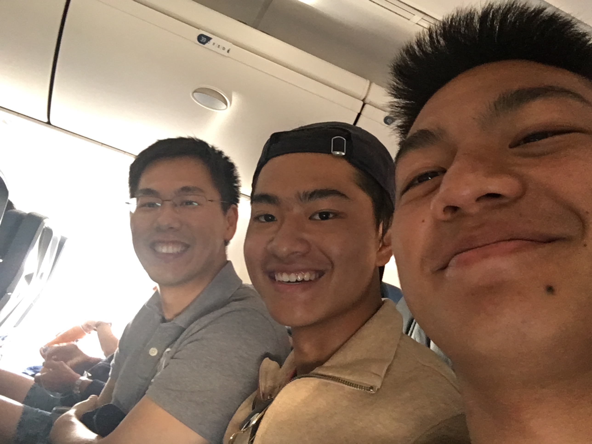

> "the continuing and spreading results of an event or action"

<!--more-->

The ripple effect can refer to large historical events that trigger one another, such as WWII lifting the United States out of the Great Depression. The ripple effect can also refer to pulling an all-nighter to make up 7 lectures before a midterm because I consistently talk myself out of taking the 15-minute bus ride to attend class.

The ripple effect isn't a novel idea - most people are aware of it. But I decided to draw special attention to this phenomenom because of something inexplicably fortuitous that happened to me this year.

# My crazy experience

After 5 days of soaking in good Cancún vibes for Spring Break, I was ready to head home and gear up for the imminent academic onslaught as classes resumed. Sitting on my left in the airplane sat my friend Alex, who I vacationed with.

A quick glance to my right revealed a strangely familiar middle-aged Asian man. I did a double-take. And a triple-take. And a quadruple take for good measure. It was [Dr. Cong Shi][1], my Statistics Professor from the Industrial & Operations Engineering department last semester. A quick exchange of hellos led to one of the best conversations I've ever had. For the entire duration of the flight, we shared stories, perspectives, and advice. I learned about Cong's online gaming days during his college days in Singapore where he was ranked globally in the MMORPG DoTA, his study-abroad experience at UC Berkeley where he had to use a shovel to stir a giant vat full of baked beans when cooking for his 40-person housing cooperative, his decision to pursue his Ph.D at MIT following a brief stint at Citi Sales and Trading, and his weekly trips with his wife and kids to Shangri-La and Hong Hua, two savory Chinese restaurants in Metro Detroit that I frequent all the time. I came out of the conversation with newfound perspectives on what I wanted out of college and my career as well.

{:class="img-responsive"}

The ripple effect of me taking his stats course led me to recognize him on the plane and engage in conversation. From this encounter, I've started to build a strong relationship with Cong. We're connected on WeChat (Chinese Social Media) - yeah, we are *that* serious. Just last week, we caught up at Fireside Café at Pierpont Commons and we've already planned our next lunch. 

# Chance Encounters

Gotta say, Cong is a damn cool guy, and I wouldn't have known any better if the circumstances had been any less perfect. Which makes me think. So many events in life are by whim. As much as we can try to plan out every action to take, there are just too many unaccountable factors.

Take the odds of this encounter for example. We both had to have gone to Cancún, leave on the same flight, AND sit in the same row. Plus, I had to have taken his class before or else I wouldn't have recognized him as anyone but a middle-aged Asian man. I would have spent the hours watching movies and TV shows through my Bose QC35s without a care in the world.

I've met close friends because we lived in the same dorm. I've met other close friends solely because we happened to sit next to each other in class. And yes, one of the most unique relationships I've formed came from recognizing a professor on an airplane. My dormmates, classmates, and fellow passengers are not under my control, yet some of these chance encounters have rippled into so many meaningful relationships and experiences shared. Definitely some food for thought.

# Reflections

With this realization that opportunities and relationships are influenced by pure randomness may lead to the frightening belief that life is just a product of circumstances, and I really want to address that. 

**Some interactions in life are unexpected but good for you. Embrace them. Maximize positive encounters to extend the ripple effect. By doing so, you are one step closer to being a product of your decisions, and not just your circumstances.**

Life is unpredictable, no doubt. However, its how we choose to respond to what you go through that really puts us in the driver's seat as decision makers, which brings me to this cheesy life to driving analogy. We can't control where the potholes and traffic jams are in our journey, but we can choose how to react to them (i.e. a detour). In addition, we ultimately decide where our final destination is, where to stop on the way, who we want to take our journey with, and how fast we want to go. Just hope the car doesn't break down.

[1]: http://www-personal.umich.edu/~shicong/
