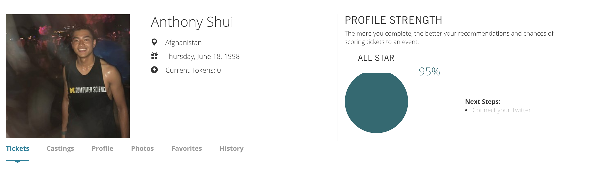
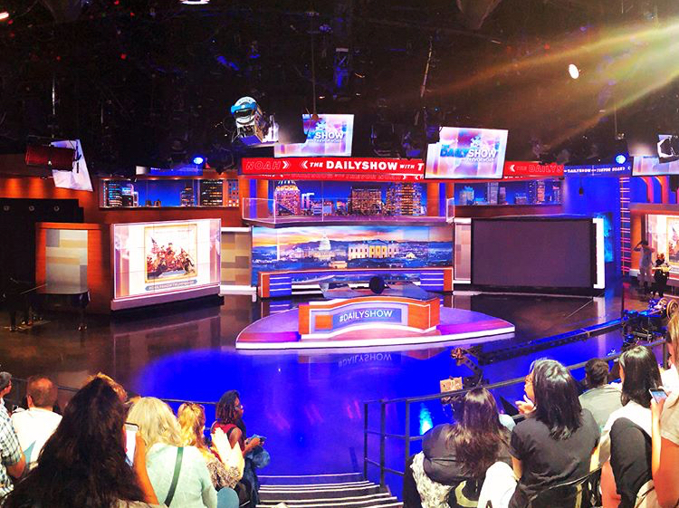
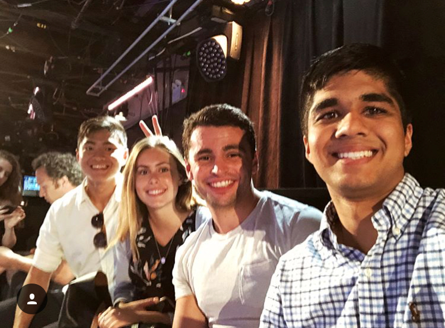

Ever see late night🌝 shows on TV and wonder how to attend them?

<!--more-->

**1iota is the holy grail**. It's the only (and free) way to get tickets to shows like *The Late Show with Stephen Colbert*, *Late Night with Seth Meyers*, *The Tonight Show Starring Jimmy Fallon*, and *SNL*.

Here's how it works:

{:class="img-responsive"}
1. Create a profile on <a href="https://1iota.com/" target="_blank">1iota</a> 😛
	* Complete your profile with as much info as possible (income bracket, marital status, education level, your social media) to increase your chances of winning! The studio wants to know the demographic of its audience👩👦🏾👵🏻 and the gov't wants to collect your data @FB 👀
	* I completed 95% of my profile, which in turn helped me get tickets to a couple shows✅
	* Trevor Noah isn't on 1iota, he's on <a href="https://www.showclix.com/event/TheDailyShowwithTrevorNoah" target="_blank">Showclix.com</a>. Tickets to *The Daily Show* are guaranteed right away instead of a raffle, but you have to order them way ahead of time
2. Enter up to 3 lotteries for each respective show. You will most likely get one of the three dates you've chosen
3. No backpacks and bring your driver's license. I brought my backpack to Seth Meyers and had to run to a nearby on-demand storage service and back.🏃‍♂️💨
4. Enjoy the show😩! FYI: there's usually a couple months before you are able to get tickets again, so make the best use of them!

{:class="img-responsive"}

While I wasn't able to get tickets to SNL (Season 44 hasn't started yet) or Jimmy Fallon (not quick enough), I was fortunate enough to get tickets to see Stephen Colbert, Seth Meyers, and Trevor Noah. Every show had me cackling, but Trevor Noah was undoubtedly the funniest with his no holds barred political commentary 🔥. He also brought out Skylar Grey 😍 AND gave away copies of the show's new book📖, <a href="https://www.amazon.com/gp/product/1984801880?tag=randohouseinc5694-20" target="_blank">The Donald J. Trump Presidential Twitter Library</a>, to the whole audience.

Definitely recommend attending these shows if you are ever in NYC. Let me know in the comment section below if this article has been helpful, and what kind of other articles you would like to see in the future!

{:class="img-responsive"}

